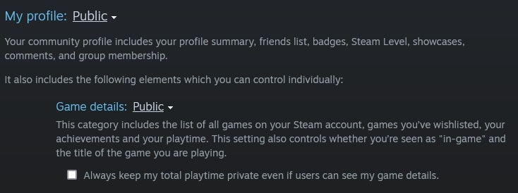
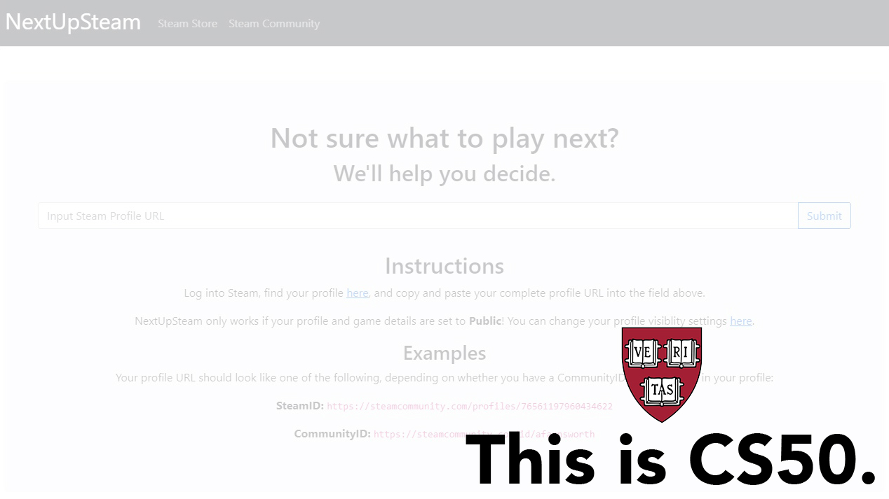
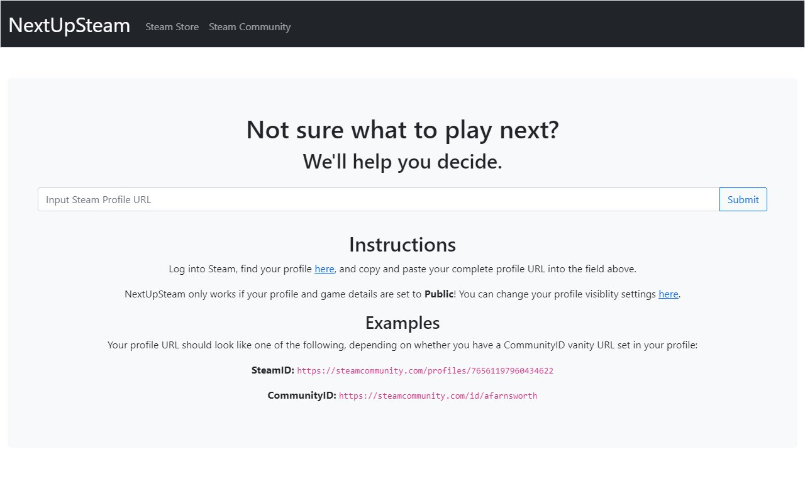

# NextUpSteam

NextUpSteam is a Flask web application that randomly selects one or two games from a user's Steam library based on total and recent playtime. The aim is to help Steam users with considerable libraries pare down their backlog of unplayed or underplayed games, one or two titles at a time.

## Usage
NextUpSteam is intended for use by users with accounts on [Steam](https://store.steampowered.com/) and multiple games in their [Steam library](https://steamcommunity.com/my/games/?tab=all).

1. Log into Steam, either on the desktop application or in your browser.

2. Go to [your Steam profile](https://steamcommunity.com/my) and copy the full URL in your address bar.

3. Go to [Edit Profile >> Privacy Settings](https://steamcommunity.com/my/edit/settings). Make sure that your Profile as well as your Game Details are set to Public view, as below.

4. Paste the full URL into the text field on NextUpSteam's main page and hit submit.

5. If you don't like the games you see, click on the "Another!" button to generate a new result.

### Game Selection Criteria

NextUpSteam searches your library for games that meet one of the two following criteria:

1. Has 0 total playtime on your account
2. Has any positive amount of total playtime on your account not accrued within the last two weeks

The application will return one game for each criterion successfully met. If your library contains no games that meet either criterion (i.e. all the games in your library have logged any positive amount of playtime within the last two weeks), NextUpSteam will instead return a random game selected from your library irrespective of playtime.

## Demo

### Video Demo

### Live Demo

## Discussion

NextUpSteam was born out of my desire to both tackle my extensive library of Steam games and to build upon what I learned about developing web applications in Week 9 of CS50x. My original idea was much more ambitious, involving additional options such as filters by genre, specific playtime, percentage of achievements attained, etc. It would also have utilized databases to store data on games retrieved from Steam's Store API so as to reduce the need to request data from the API every time the app was used.

Ultimately, I decided to scale back the scope of the app and strike a balance between that original idea and a barebones app that simply returned a random game. I knew I had plenty of unplayed games in my own library alongside other games that I had only briefly played for a few minutes before never touching again, so I designed the app to return two games from a library, ensuring that users would have at least one option they might like regardless of whether they were in the mood to play something they'd never played before or something they wanted to revisit.

One of the major lessons learned from the process of designing NextUpSteam was working with APIs, and working with Steam's Web and Store APIs required me to thoroughly study how the data that I requested was structured. From there, I wrote a few functions in `helpers.py` to sort, store, and pull the data. After I had a functional version of the app that I was happy with, I focused on tightening up and refactoring the entire design. I added logic that would handle cases in which a user's library might not have at least one game for each criterion (or even any game that met either criterion) and replaced repetitive sections of code with conditionals and loops that produced the same results in much fewer lines.

Once I am more confident in my ability to work with larger databases and more complex designs, I would like to add the additional filters from my original idea, implement a database to reduce the number of requests made to Steam's APIs, and overhaul the UI to something sleeker and more distinctive.

## Acknowledgements

NextUpSteam was built with [Bootstrap](https://getbootstrap.com/) and [Flask](https://flask.palletsprojects.com/). The live demo is hosted on [Heroku](https://www.heroku.com/).