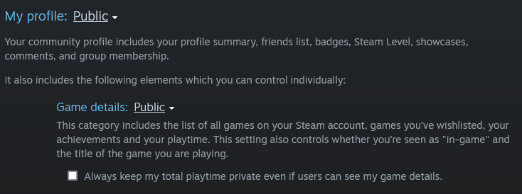

# NextUpSteam

NextUpSteam is a Flask web application that randomly selects one or two games from a user's Steam library based on total and recent playtime. The aim is to help Steam users with considerable libraries pare down their backlog of unplayed or underplayed games, one or two titles at a time.

## Usage
NextUpSteam is intended for use by users with accounts on [Steam](https://store.steampowered.com/) and multiple games in their [Steam library](https://steamcommunity.com/my/games/?tab=all).

1. Log into Steam, either on the desktop application or in your browser.

2. Go to [Edit Profile >> Privacy Settings](https://steamcommunity.com/my/edit/settings). Make sure that your Profile as well as your Game Details are set to Public view, as below.

3. Go to [your Steam profile](http://steamcommunity.com/my) and copy the full URL in your address bar.

4. Paste the full URL into the text field on NextUpSteam's main page and hit submit.

5. If you don't like the games you see, click on the "Another!" button to generate a new result.

### Game Selection Criteria

NextUpSteam searches your library for games that meet one of the two following criteria:

1. Has 0 total playtime on your account
2. Has any positive amount of total playtime on your account not accrued within the last two weeks

The application will return one game for each criterion successfully met. If your library contains no games that meet either criterion (i.e. all the games in your library have logged any positive amount of playtime within the last two weeks), NextUpSteam will instead return a random game selected from your library irrespective of playtime.

## Demo

Video Demo TBA

Live Demo (Heroku) TBA

## Acknowledgements

NextUpSteam was built with [Bootstrap](https://getbootstrap.com/) and [Flask](https://flask.palletsprojects.com/). The live demo is hosted on [Heroku](https://www.heroku.com/).